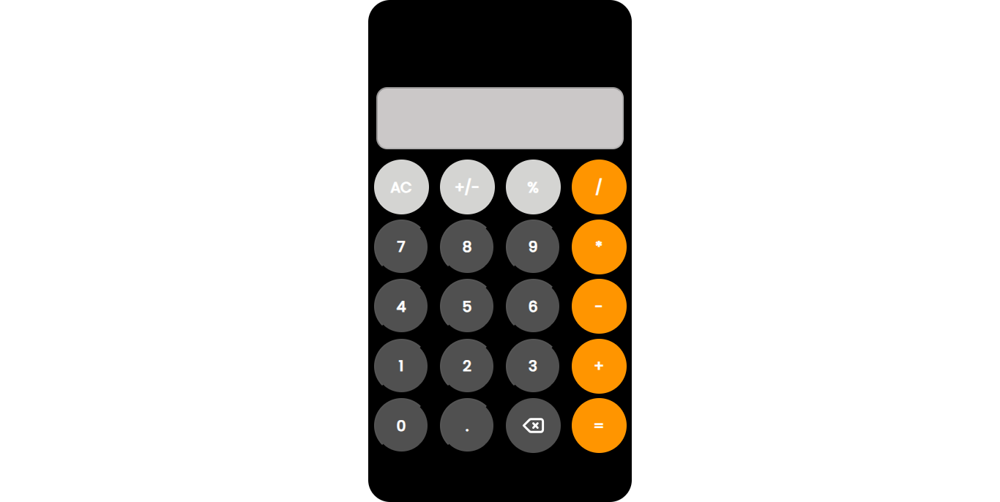

# PROJECT NAME
- Calculator Web App

## View
- 

## About
- Building a calculator web app with reference to the iPhone calculator app

## Design
- Several details about this particular design can be seen here, "https://www.google.com/search?sca_esv=4adba2849009b538&rlz=1C1CHZN_enCM1063CM1063&sxsrf=AE3TifPWjhR5r0puSNujOR3WGiRMvX_8LQ:1765635567658&udm=2&fbs=AIIjpHxU7SXXniUZfeShr2fp4giZ1Y6MJ25_tmWITc7uy4KIeoJTKjrFjVxydQWqI2NcOhYPURIv2wPgv_w_sE_0Sc6Q_7Pv7l13oPoHoSfb2CeJ8hufYaACclghvGZKCXsCg1BDtOOWRJypbVAsDtEGdCAiQcgQUgyL-bukE6scNOPAf7EuSjNhbSZhJMo3i1YmHWVG2qzUzOuLHz_eKpQmvb7A3R-Qyg&q=iphone+calculator&sa=X&sqi=2&ved=2ahUKEwimmsCG4bqRAxXAh_0HHee0OYgQtKgLegQIFhAB&biw=1366&bih=679&dpr=1"

## Built With
- HTML 5
- CSS styles
- JavaScript

## Prerequisites
Knowledge about
- HTML
- CSS
- JavaScript

## Clone project
To get a copy to your local directory:
- Clone the repository by running 'git clone "https://github.com/SalahVincent/Calculator_Web_App"' on your terminal

## Starting project
Steps:
- Right click on the index.html file
- Left click on copy path
- paste the path on your browser and enter

## Live site
-[Link](https://salahvincent.github.io/Calculator_Web_App/)

## Author
**Vincent Salah**

- GitHub:
[@SalahVincent](https://github.com/SalahVincent)

## Show your support
Give me a star if you like this project!